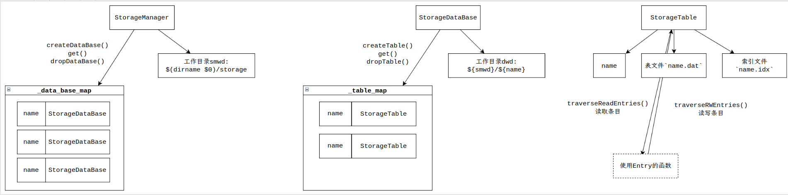

# 存储引擎

MYG-SQL的存储引擎是一个简单的二进制文件映射器, 目前支持在Linux平台上通过映射文件来读写数据。

在讨论存储引擎之前，我需要先说明文件存储格式。如果你想参与其他部分的开发，你不需要关心这一块，请跳转到"**使用方法&示例**"章节。

## 数据库格式

数据库的存储池目录位于数据库可执行文件所在的目录下，一般叫作`storage`. 对于每个叫作`pool`的存储池, 都有一个叫`pool`的目录. 对于`pool`下的每一张表`table`, 都有一个叫`table.idx`的索引文件与叫`table.dat`的条目文件.

### 存储池索引文件`${table}.idx`

索引文件可以使用如下结构体表示:

```C++
enum class DataType: uint32_t {
    INT = 0, STRING = 1
}; // enum DataType

/** 所有存放方式均为大端序，以4字节对齐 */
struct IndexFile {
    /** 元数据 */
    uint32_t index_size;    // 索引区大小，单位是个数
    uint32_t primary_index; // primary index在第几个

    /** 索引区 */
    struct IndexUnit {
        uint32_t name_index;  // 名称字符串首地址所属的索引
        uint32_t name_length; // 名称长度所属的索引
        DataType data_type;   // 数据类型
    } units[index_size]; /////// 索引单元列表, 4字节对齐

    /** 字符串常量区, 使用UTF-8编码. 1字节对齐 */
    uint8_t []string_buffer;
}; // struct IndexFile
```

### 存储池条目文件`${table}.dat`

条目文件可以使用如下的结构体表示:

```C++
/** 存放方式: 大端序, 按条目紧密存放
 *  对齐:     4字节对齐 */
struct TableFile {
    uint32_t entry_length; // 条目的个数，包含已分配空间的条目与未分配空间的条目
    Entry    entries[];    // 条目列表
}; // struct TableFile

struct Entry {
    uint32_t is_allocated; // 是否已经分配空间, bool类型
    union {
        int32_t int_value; // 4字节整数成员, 任取整数x, 当unit[x]为INT时items[x]的类型就是int_value
        CharBuf string_value; // 256字节+4字节字符串成员, 任取整数x, 当unit[x]为STRING时items[x]的类型就是string_value
    } items[];
}; // struct Entry

struct CharBuf {
    uint32_t length;          // 长度
    uint8_t  characters[256]; // 256字节定长字符串
}; // struct CharBuf
```

这里说一下Entry这个存储单元，上面写的union写得不是很清楚。有啥问我吧, 我实在想不到该怎么解释. 这里放个例子给大家:

```sql
create table Student (name string primary, age int, score int)

=> 索引文件::Entry
首地址   大小   类型       名称
0       4     bool    {is_allocated}
4       260   string  "name"
264     4     int     "age"
268     4     int     "score"
```

## 数据库文件的内存映射

显然，在打开一个数据库文件之前我们不知道里面的条目是用什么格式存储的，所以没办法用一个结构体来表示所有的文件格式。不过使用键值对列表来存储索引或许是一个好主意。

在MYG-SQL中, 每个数据库存储池`StorageTable`内置一个索引列表用于保存名称与映射信息. `StorageTable`类提供了通过名称字符串查找索引单元的类型与偏移量的API.

这个类只给出了名称、类型与偏移量的映射关系, 所以还需要一个存放数据库条目的"内存块"来找到真实的内存位置. 恰好, 有个包装类`StorageTable::Entry`:

```C++
class StorageEntry {
    mtbptr begin;               // 起始内存, 实际位置是起始内存+用于判断是否分配的4字节
    EntryIndexList &index_list; // 索引表

    /** 显然只有上面的属性还不安全, 所以还有一些读写对象的API */
    Value *get(string name);
    bool set(string name, int value);
    bool set(string name, string value);
    bool set(string name, Value const& value);
}; // Entry
```

> 需要注意的是, 出于兼容性与安全的考虑, **本文档中给出的类的成员不一定是实际的成员**. 比如说, 因为映射块首地址可能会发生改变, 所以`StorageEntry`类的`begin`属性就是以`get_begin`函数提供的.

## 数据库文件集合的管理



## 使用方法&示例

> 我现在写完的部分还没有测试, 所以不保证构建成功.

数据库的文件管理是由`StorageManager`负责的,该类同时负责处理database相关的语句.

`create database`语句:

由全局单例的`StorageManager`对象`global_storage_manager`处理:

```C++
unowned<StorageDataBase> db = global_storage_manager.createDataBase(name);
```

`drop database`语句:

```C++
global_storage_manager.dropDatabase(name);
```

`use database`语句:

```C++
unowned<StorageManager> db = global_storage_manager.get(name);
```

`create table`语句:

```C++
std::vector<StorageTypeItem> type_item_list = ...;
unowned<StorageTable> table = db.createTable(name, type_item_list);
```

`drop table`语句:

```C++
unowned<StorageTable> table = db.dropTable(name);
```

在构建需要Table的语句时,往往要从table文件中加载数据, 然后在数据库执行引擎中整理成方便查询的形式. 这时, 你可以用`traverseReadEntries(lambda)`方法来加载条目, 并在同步硬盘时使用`traverseRWEntries(lambda)`来写回条目.

上述两个方法要求你的lambda表达式接受一个类型为`Entry`的参数. 在这个Entry里面,你可以调用`get(name)`来获取值, 调用`set(name, value)`来设置某个值.

注意, `get()`返回的是一个类型为`Value`的指针, 你可以把它`dynamic_cast`到`IntValue`或者`StringValue`来获取详细的值, 或者调用`toString()`方法把他们转化为字符串. 这几个`Value`类是可以直接比较大小的.
